# DIY GoPro3 video out cable
_original: https://rcexplorer.se/projects/2012/11/diy-gopro3-video-out-cable/_

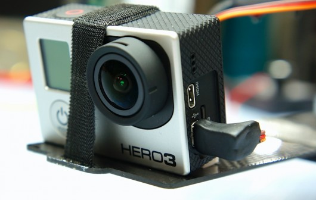

GoPro just released their new Hero3 HD camera lineup, which boasts being 30% smaller, 25% lighter while being able to deliver 1080p in 60 frames per second and even 2.7K in 30FPS .

But while shrinking the camera, Gopro removed the 2.5mm video out jack. But fear not, the GoPro 3 is still able to output the composite video we need for FPV flying. Instead of a normal 5 pin mini USB connector, GoPro chose the much less common 10 pin version. This connector now contains the standard USB pins as well as microphone input and the video output.

Unfortunately it’s not as straight forward as simply soldering the cable to the connector. A 100K ohm resistor is also needed to kick the camera into video out mode. In this guide I’ll guide you through making your own cable, so that you too can enjoy the live output of this great camera, without having to dish out 20$ for a bulky cable from GoPro.

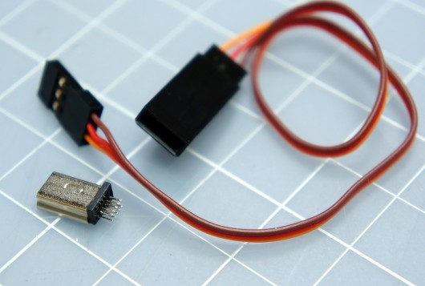

First off you need to get your hands on a 10 pin mini USB connector.
They can be found on various electronic stores online.
I ordered mine [here](http://www.chargeconverter.com/store/index.php?route=product/product&product_id=160). You also need a 100K resistor. Any watt rating will do, as there will only be microamps going through it. I used a standard thru-hole 1/4W resistor I had laying around. It’s a little big so if you need to order the resistor I recommend getting a smaller one, like a 1/8W. You also need a cable of some sort. I used a 32 AWG servo lead, which is nice and thin.

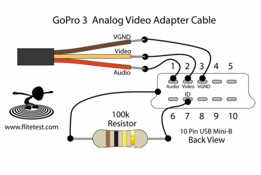
This is how we’re going to connect everything.

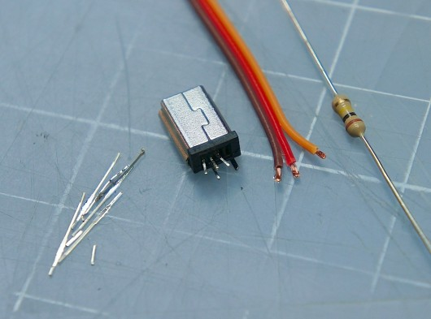

I removed the unused pins to gain more space, reduce the chance of a short and make it easier to work on.

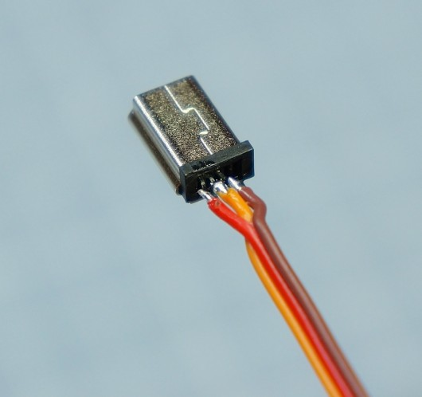

I soldered the cables first, which I think is a good move as they are the most fiddly. Do not use to much heat on the soldering iron or the connector and/or the insulation on the wires will melt.

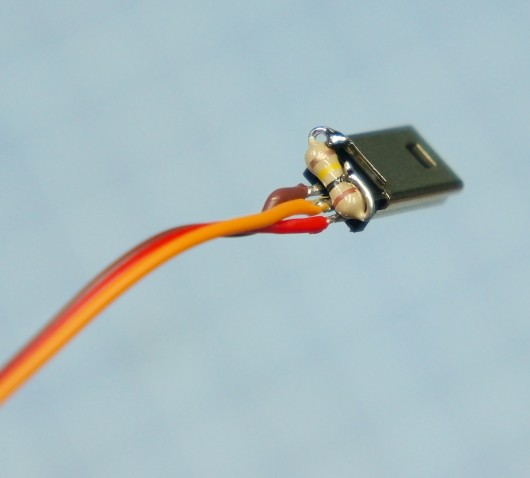

The resistor is connected between pin 7 (the ID pin) and ground. This is how I mounted my resistor. The metal case of the connector is connected to ground inside of the GoPro, but if you wanted you could connect it to the video ground pin instead. Connecting it to the case does make it very sturdy though and there is no chance of it shifting around.

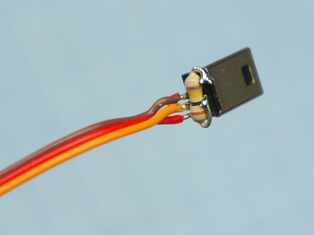
Pretty compact considering the size of the resistor.

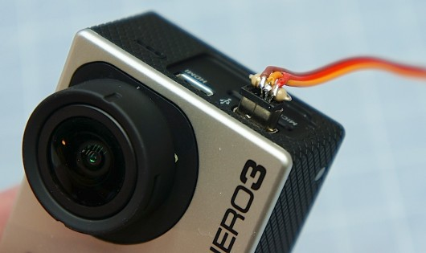
I wanted my connector to stick out as little as possible, so I bent the wires 90° back over the resistor.

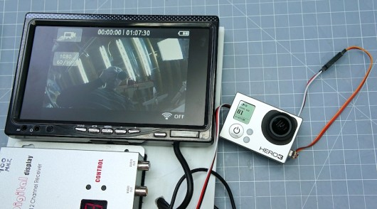
Yay! It works! Time to make the cable robust.

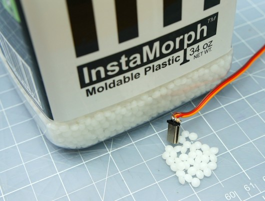
To make the cable as though as possible I decided to use “InstaMorph”, which is a plastic that after it’s been heated up can be shaped and molded into almost any shape. Once cooled of it becomes incredible hard and very though. [Check out Chads excellent video showing how to use “InstaMorph”](http://flitetest.com/articles/InstaMorph_R/C_Plane_Repair)

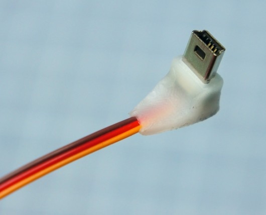
Instamorph is awesome.

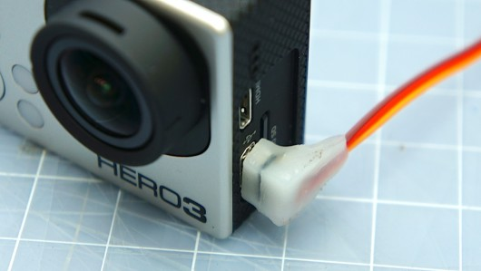
Pretty streamlined but still easy to grab and pull out.

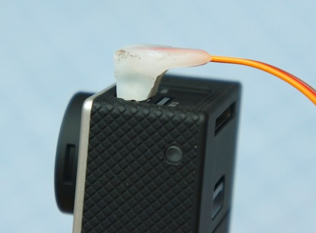
Time to paint it.

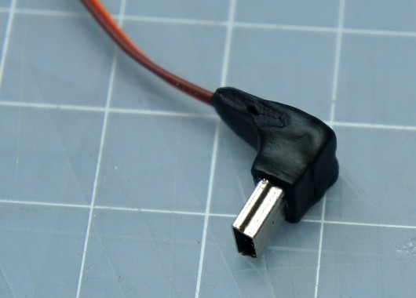
The paint stick well to the Instamorph.

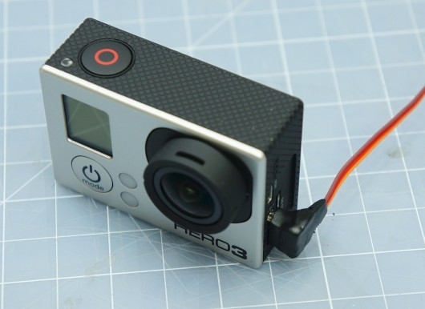
Done! Works like a charm, low weight, robust and easy to plug in and out. What more could ask for?

Here is the DIY cable vs the original GoPro cable.

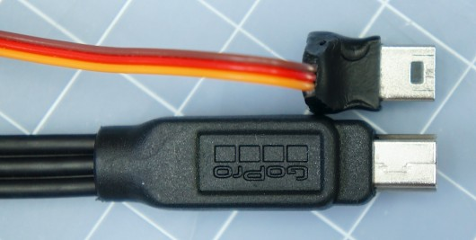
Much more streamlined.

Now get out there and make awesome FPV videos using your new GoPro3 video out cable!
